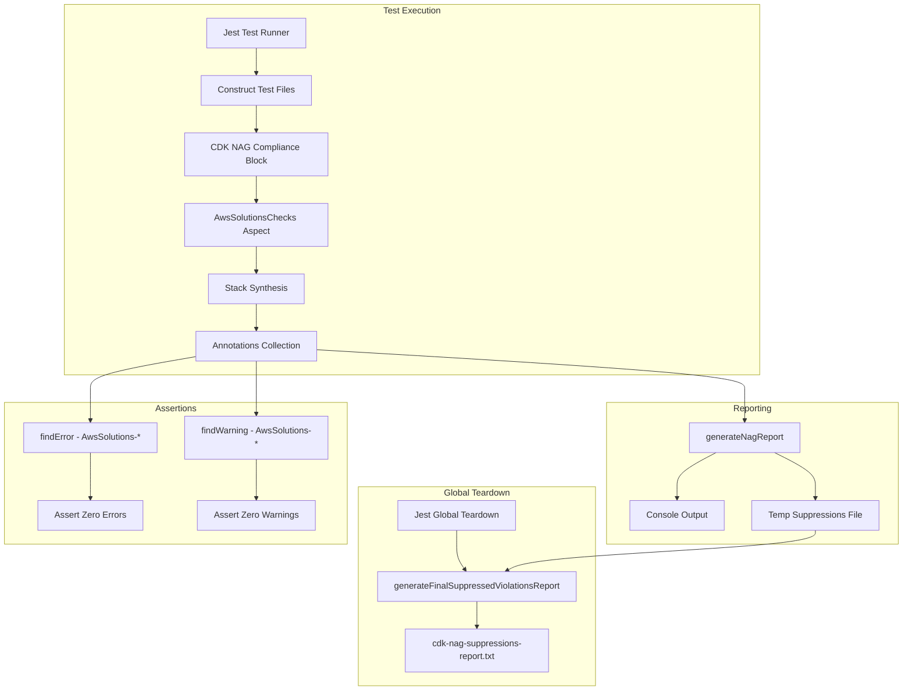

# Design Document

## Overview

This design describes the integration of CDK NAG compliance scanning into the OSML Tile Server CDK infrastructure project. The implementation leverages the existing `test-utils.ts` file which already contains the core NAG reporting utilities, and extends the test framework to include compliance checks for all CDK constructs.

The solution follows the OSML project patterns for CDK NAG compliance testing, using the AwsSolutionsChecks rule pack to validate infrastructure against AWS security best practices.

## Architecture



## Components and Interfaces

### 1. Jest Configuration Update

The `jest.config.js` file needs to be updated to include the global teardown hook:

```typescript
module.exports = {
  testEnvironment: "node",
  roots: ["<rootDir>/test"],
  testMatch: ["**/*.test.ts"],
  transform: {
    "^.+\\.tsx?$": ["ts-jest", { tsconfig: "tsconfig.json" }]
  },
  globalTeardown: "<rootDir>/test/test-utils.ts"
};
```

### 2. CDK NAG Compliance Test Block Pattern

Each construct test file will include a compliance test block following this pattern:

```typescript
import { Aspects } from "aws-cdk-lib";
import { Annotations, Match } from "aws-cdk-lib/assertions";
import { AwsSolutionsChecks } from "cdk-nag";
import { generateNagReport } from "../../test-utils";

describe("cdk-nag Compliance Checks - ConstructName", () => {
  let stack: Stack;
  let errors: SynthesisMessage[];
  let warnings: SynthesisMessage[];

  beforeAll(() => {
    // Stack setup code...

    // Apply AwsSolutionsChecks with verbose logging
    Aspects.of(stack).add(new AwsSolutionsChecks({ verbose: true }));

    // Collect errors and warnings
    errors = Annotations.fromStack(stack).findError(
      "*",
      Match.stringLikeRegexp("AwsSolutions-.*")
    );
    warnings = Annotations.fromStack(stack).findWarning(
      "*",
      Match.stringLikeRegexp("AwsSolutions-.*")
    );

    // Generate compliance report
    generateNagReport(stack, errors, warnings);
  });

  test("No unsuppressed Warnings", () => {
    expect(warnings).toHaveLength(0);
  });

  test("No unsuppressed Errors", () => {
    expect(errors).toHaveLength(0);
  });
});
```

### 3. NAG Suppression Pattern

When findings cannot be remediated, suppressions are added using the NagSuppressions API:

```typescript
import { NagSuppressions } from "cdk-nag";

NagSuppressions.addResourceSuppressions(
  resource,
  [
    {
      id: "AwsSolutions-XXX",
      reason: "Specific justification explaining why this rule does not apply"
    }
  ]
);
```

### 4. Existing Test Utilities (test-utils.ts)

The `test-utils.ts` file already provides:

- `generateNagReport()`: Outputs compliance report to console and appends to temp file
- `extractSuppressedViolations()`: Extracts suppressions from stack template metadata
- `generateFinalSuppressedViolationsReport()`: Generates consolidated report file
- Default export for Jest global teardown

## Data Models

### NagFinding Interface
```typescript
interface NagFinding {
  resource: string;
  details: string;
  rule: string;
}
```

### SuppressedNagViolation Interface
```typescript
interface SuppressedNagViolation {
  rule: string;
  resource: string;
  reason: string;
  appliesTo?: string[];
  stackName?: string;
}
```

## Correctness Properties

*A property is a characteristic or behavior that should hold true across all valid executions of a system-essentially, a formal statement about what the system should do. Properties serve as the bridge between human-readable specifications and machine-verifiable correctness guarantees.*

Property 1: Zero Unsuppressed Errors
*For any* CDK stack with AwsSolutionsChecks applied, the count of unsuppressed errors matching "AwsSolutions-*" pattern should be zero after all remediations and suppressions are applied.
**Validates: Requirements 1.2, 3.5, 4.4**

Property 2: Zero Unsuppressed Warnings
*For any* CDK stack with AwsSolutionsChecks applied, the count of unsuppressed warnings matching "AwsSolutions-*" pattern should be zero after all remediations and suppressions are applied.
**Validates: Requirements 1.3, 3.4**

Property 3: Suppression Completeness
*For any* NAG suppression in the stack template metadata, the suppression should contain both a non-empty rule ID and a non-empty reason string.
**Validates: Requirements 4.3**

Property 4: Report Content Completeness
*For any* generated suppressions report, the report should contain: a summary section with counts by rule, sections grouped by stack name, and for each suppression entry the resource ID, rule ID, and justification.
**Validates: Requirements 5.1, 5.2, 5.3**

## Error Handling

1. **Missing Stack**: If a stack is not properly synthesized before NAG checks, the test will fail with a clear error message.

2. **Invalid Suppression Format**: If a suppression is added without required fields, CDK NAG will throw an error during synthesis.

3. **Report Generation Failure**: If the report file cannot be written, the teardown function logs a warning but does not fail the test run.

## Testing Strategy

### Unit Testing

Unit tests verify:
- Jest configuration includes globalTeardown
- Each construct test file includes CDK NAG compliance block
- NAG suppressions have valid format with rule ID and reason

### Property-Based Testing

Property-based tests will use the `fast-check` library to verify:
- Property 1: Zero errors for all stacks (verified by existing Jest assertions)
- Property 2: Zero warnings for all stacks (verified by existing Jest assertions)
- Property 3: All suppressions have required fields
- Property 4: Report contains all required sections and fields

The property tests are implemented as part of the CDK NAG compliance test blocks in each construct test file. The assertions `expect(errors).toHaveLength(0)` and `expect(warnings).toHaveLength(0)` serve as the property verification.

For Property 3 and 4, dedicated tests will verify the suppression format and report content structure.

### Test Files to Update

The following test files require CDK NAG compliance blocks:
1. `cdk/test/constructs/tile-server/database.test.ts`
2. `cdk/test/constructs/tile-server/dataplane.test.ts`
3. `cdk/test/constructs/tile-server/ecs-roles.test.ts`
4. `cdk/test/constructs/tile-server/ecs-service.test.ts`
5. `cdk/test/constructs/tile-server/messaging.test.ts`
6. `cdk/test/constructs/tile-server/network.test.ts`
7. `cdk/test/constructs/tile-server/storage.test.ts`
