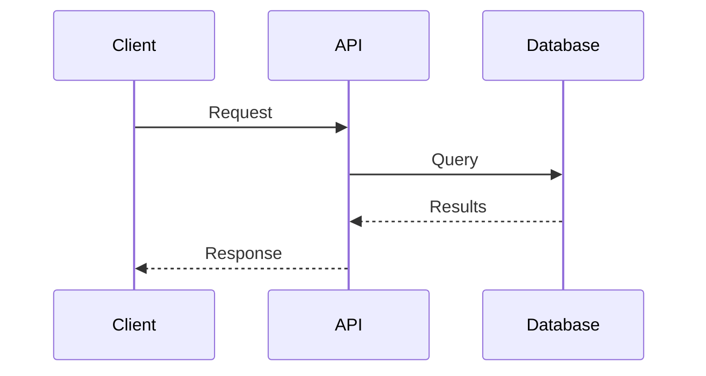

# OSML Code Conventions

Code style, documentation, and quality standards for OversightML projects.

## Licensing and Copyright

All source files require a one-line copyright header. Full license terms are in the LICENSE file.

**Python:**
```python
#  Copyright 2023-2025 Amazon.com, Inc. or its affiliates.
```

**TypeScript:**
```typescript
/*
 * Copyright 2023-2025 Amazon.com, Inc. or its affiliates.
 */
```

**Dockerfile:**
```dockerfile
# Copyright 2023-2025 Amazon.com, Inc. or its affiliates.
```

## Docstring Format (Sphinx)

Use Sphinx directives. Do NOT include `:type:` or `:rtype:` - sphinx-autodoc-typehints extracts types from annotations.

```python
def process_data(data: str, max_retries: int, timeout: Optional[float] = None) -> bool:
    """
    Process the input data with retry logic.

    :param data: The data string to process
    :param max_retries: Maximum number of retry attempts
    :param timeout: Optional timeout in seconds
    :return: True if processing succeeded, False otherwise
    :raises ValueError: If data is empty or max_retries is negative
    """
```

## Type Annotations

- Always include type hints for function parameters and return values
- Use `typing` module for complex types (`Optional`, `List`, `Dict`)
- Type annotations are the source of truth for documentation

## Code Style

| Setting | Value |
|---------|-------|
| Line length | 125 characters |
| Formatter | black |
| Import sorter | isort (black profile) |
| Linter | flake8 (ignore E203, W503, W605) |

## Pre-commit Hooks

All OSML projects use pre-commit with these hooks:

```yaml
repos:
  - repo: https://github.com/pre-commit/pre-commit-hooks
    hooks: [check-yaml, end-of-file-fixer, trailing-whitespace]
  - repo: https://github.com/psf/black
    hooks:
      - id: black
        args: ["--line-length=125"]
  - repo: https://github.com/PyCQA/isort
    hooks:
      - id: isort
        args: ["--line-length=125", "--profile=black"]
  - repo: https://github.com/PyCQA/flake8
    hooks:
      - id: flake8
        args: ["--ignore=E203,W503,W605", "--max-line-length=125"]
  - repo: https://github.com/sbrunner/pre-commit-copyright
    hooks: [copyright, copyright-required]
```

### Running Linters

```bash
# Run all pre-commit hooks
tox -e lint

# Install hooks for automatic runs
pip install pre-commit
pre-commit install
```

## Design Documents

Use Mermaid syntax for diagrams in design docs (`.kiro/specs/*/design.md`):



Supported types: sequence diagrams, class diagrams, flowcharts, state diagrams, ERDs.

## General Guidelines

- Keep docstrings concise but informative
- Document all public APIs
- Include examples for non-obvious behavior
- Run `tox -e lint` before submitting code
